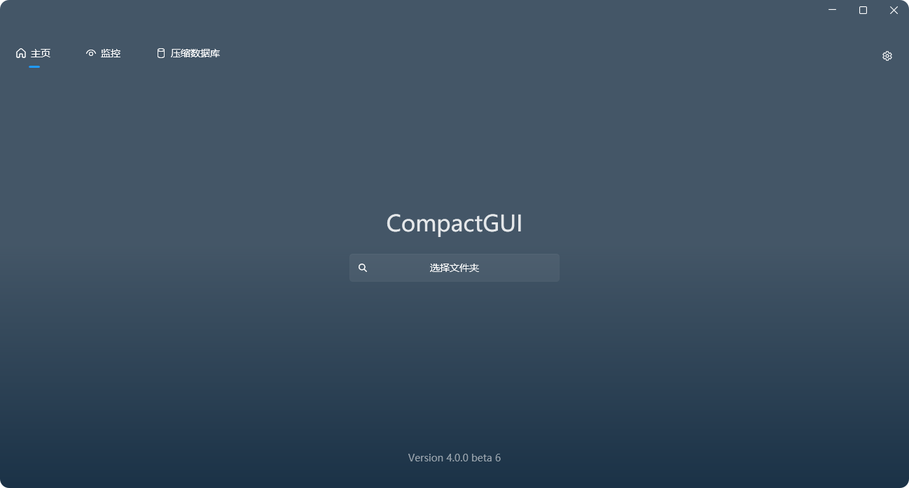
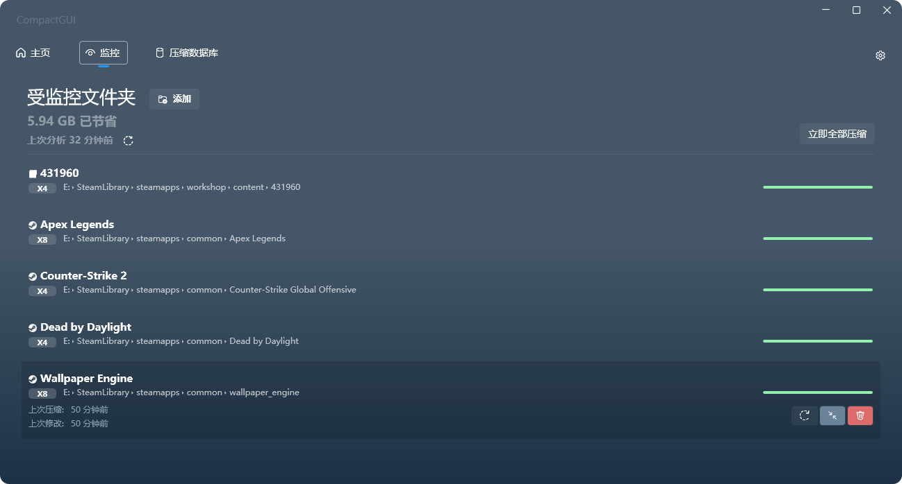

<p align="center"></p>

<p align="center">
  <a href="https://github.com/IridiumIO/CompactGUI/releases">
    
    
  </a>
  </br> 
</p>

<p align="center"><b>CompactGUI 会透明地压缩你的游戏和程序，在不影响其功能的情况下减少它们的空间占用。它直接调用 Win32 API 以实现与 Windows 10 及更高版本中原生的 <code>compact.exe</code> 命令行工具相同的功能。</b></p>

&nbsp;
&nbsp;

<p align="center"></p>
<p align="center">



</p>

---

<p align="center">
  <a href="../README.md">English</a> -
  <a href="README_ru.md">Русский</a> -
  简体中文 -
  <a href="README_it.md">Italian</a>
</p>
&nbsp;

**它是怎么工作的**：

CompactGUI 是一个友好的图形界面，它利用了 Windows 10 中首次引入的高性能压缩功能，即由 Windows 覆盖过滤器（WOF）驱动公开的底层文件系统压缩算法。它允许透明地压缩任何文件或文件夹（重点是游戏），而不会导致任何性能损失并节省大量存储空间。

**透明的？这是什么意思？**

透明压缩意味着文件就像无事发生一样，仍然可以在计算机上正常使用——它们没有像 zip 和 rar 文件那样被重新打包。你仍然可以像之前一样浏览、启动游戏和程序，只是它们占用了更少的空间。

**这与旧版本 Windows 中的内置压缩有何不同？**

这与 Windows 中内置的旧版压缩选项 _类似_ （右键 > 属性 > 高级 > 压缩内容以便节省磁盘空间）。然而，Windows 10+ 中引入的新算法要更胜一筹，它在几乎无性能影响的情况下实现了更高的压缩比。[更多信息可以在这里找到](<https://learn.microsoft.com/zh-cn/windows/win32/cmpapi/using-the-compression-api>)

<h2>安装</h> 
   
####

<a href="https://github.com/IridiumIO/CompactGUI/releases">
  
</a>

或通过 Winget 安装：

```py
winget install CompactGUI
```

## 用途

使用此工具压缩文件夹的同时仍然能正常使用/运行它们：

- 减少游戏的大小（例如 方舟：生存进化：169 GB > 91.2 GB）
- 减少程序的大小（例如 Adobe Photoshop：1.71 GB > 886 MB）
- 压缩你计算机上的任意文件夹

## 额外功能

- 压缩过程和统计数据拥有视觉反馈
- 可配置的跳过列表，跳过压缩率低的文件类型，可以单独配置每个文件夹
- 压缩预估——基于超过 100,000 个社区提交的数据构建（老实说其实更多，但我没有意识到 Google 表单在第 100,000 个时崩溃了，所以我丢失了很多提交），以获得许多 Steam 游戏的准确数据
  - 非 Steam 游戏则改用算法估算，仍然能给出可压缩性的合理判断
  - 如果你愿意做出贡献，可以在 CompactGUI 内将 Steam 游戏压缩结果提交至在线数据库
- 集成到 Windows 资源管理器的上下文菜单中以便使用
- 分析现有文件夹的压缩状态
- 后台监控——追踪并监控文件夹的变化（例如 Steam 游戏更新）并自动在后台维持它们的压缩状态

<h4 align="center"><b>请参阅 <a href="https://github.com/ImminentFate/CompactGUI/wiki/Community-Compression-Results">Wiki</a>，查看超过 100,000 份提交中已测试过的 <a href="https://github.com/ImminentFate/CompactGUI/wiki/Community-Compression-Results"></a> 的列表 </b></h3>
<p>&nbsp;</p>

## 注意事项

**这个工具不应用于在 Windows 11 上使用 DirectStorage 技术的游戏。**

DirectStorage 是一个新的 API，它允许游戏绕过 CPU，直接从固态硬盘上加载资源。已压缩的文件在发送到 GPU 前需要解压缩，这将抵消任何的性能提升。

## 背景

Windows 10 引入了一个鲜为人知但非常实用的工具，叫做 `compact.exe`。它允许用户压缩磁盘上的文件夹和文件，并在运行时解压它们。在任何现代 CPU 上（我已经测试过像 2010 年的 i3-370M 这样老的处理器，影响可以忽略不计），这种额外开销几乎察觉不到，且节省的空间对于固态硬盘容量较小的用户非常有用。

由于程序文件夹和游戏最多可以减少 60% 的空间占用，这还带来了一个额外的好处：有可能减少加载时间——尤其在速度较慢的机械硬盘上。

有关该 Windows 内置功能的更多信息，请参阅 [此处](https://learn.microsoft.com/zh-cn/previous-versions/windows/it-pro/windows-xp/bb490884(v=technet.10)) 和 [此处](https://learn.microsoft.com/zh-cn/windows/win32/cmpapi/using-the-compression-api) 或在命令提示符中键入 `compact /q`。

此工具特意设计为只能压缩文件夹和文件。无法从 CompactGUI 中压缩整个驱动器和 Windows 系统——需要该功能的用户应在命令提示符中使用 `compact /compactOS`。

压缩是完全透明的——程序，游戏和文件仍可访问，并且在资源管理器里照常显示。它们在磁盘上保持压缩状态，仅在运行时解压到内存中。

## 压缩模式

默认情况下，程序调用 Compact 并使用 `XPRESS8K` 算法。它在压缩速度与压缩率之间取得了良好平衡。Windows 默认使用 `XPRESS4K`，它的压缩速度更快但压缩率更低。

可选压缩模式：

| 算法 | 核心优势 | 详细描述 |
| :--- | :--- | :--- |
| XPRESS4K | 最快，但压缩率最低 | 适用于对读取速度要求极高的游戏文件，它能在压缩的同时发挥最佳性能。 |
| XPRESS8K | 兼顾了速度与压缩率 | 较好地兼顾了压缩速度与压缩率。 |
| XPRESS16K | 较慢，但压缩率更高 | 适用于存储空间有限且对加载速度要求不高的场景。 |
| LZX | 最慢，但压缩率最高 | 适用于存储归档文件、备份数据，或不常访问的冷数据。 |

---

### 喜欢这个项目？

请考虑在 Ko-Fi 上打赏 :)

 <p align="center"><a href='https://ko-fi.com/iridiumio' target='_blank'></a></p>
