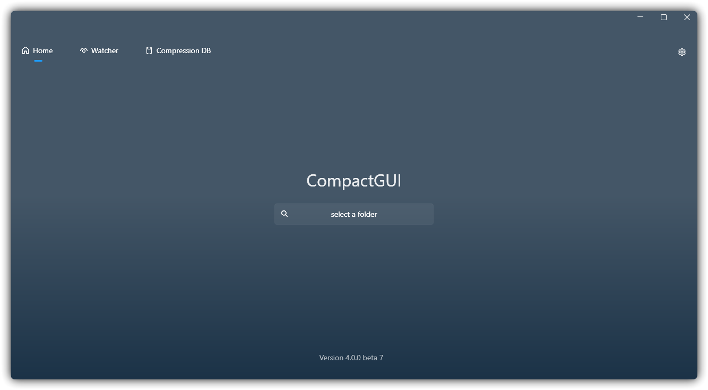
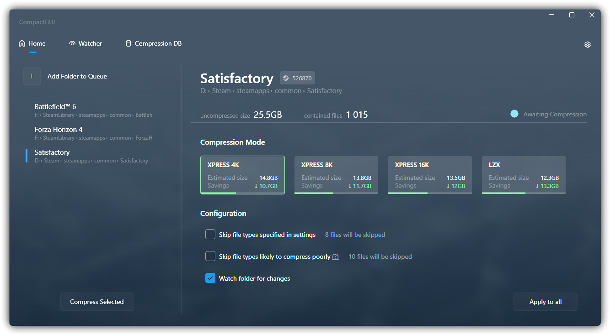
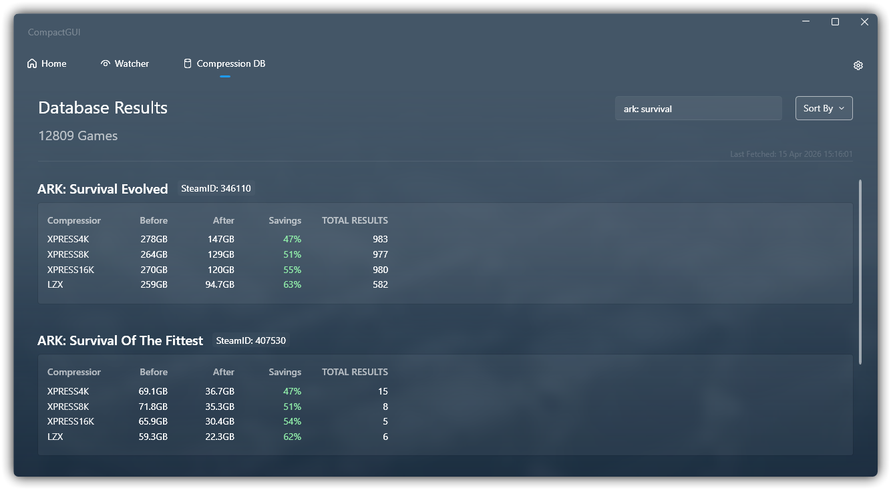
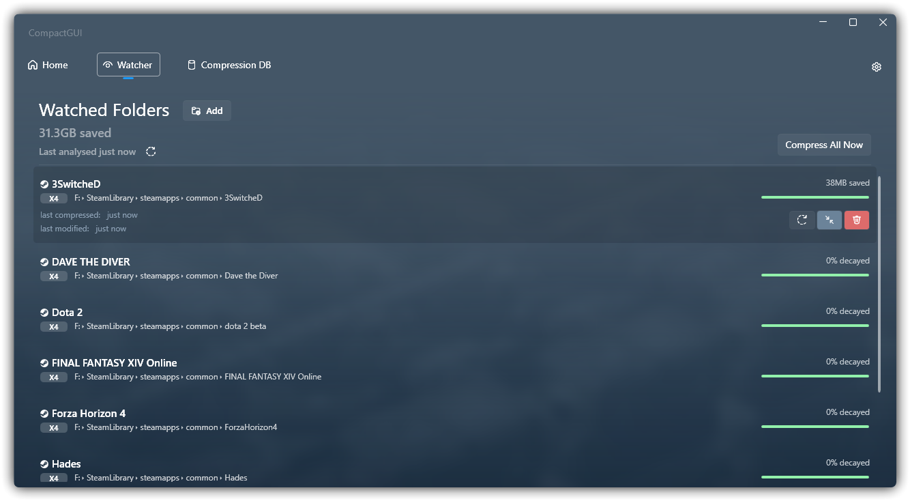

<p align="center"></p>

<p align="center">
  <a href="https://github.com/IridiumIO/CompactGUI/releases">
    
    
  </a>
  </br>
</p>

<p align="center"><b>CompactGUI mengompresi game dan program Anda secara transparan, mengurangi ruang yang digunakan tanpa memengaruhi fungsinya. CompactGUI bekerja langsung dengan Win32 API untuk mencapai hasil yang sama seperti alat baris perintah bawaan <code>compact.exe</code> yang tersedia mulai Windows 10.</b></p>

&nbsp;
&nbsp;

<p align="center"></p>
<p align="center">



</p>

---

<p align="center">
  <a href="../README.md">English</a> -
  <a href="README_ru.md">Русский</a> -
  <a href="README_cn.md">简体中文</a> -
  <a href="README_it.md">Italian</a> -
  <a href="README_id.md">Bahasa Indonesia</a>
</p>
&nbsp;

**Cara kerjanya**:

CompactGUI adalah antarmuka yang mudah digunakan dan memanfaatkan algoritma kompresi sistem file yang disediakan oleh driver Windows Overlay Filter (WOF), menggunakan kompresi berperforma tinggi yang pertama kali diperkenalkan di Windows 10. CompactGUI memungkinkan file atau folder apa pun (dengan fokus pada game) dikompresi secara transparan, tanpa kehilangan performa yang berarti dan dengan potensi penghematan ruang penyimpanan yang besar.

**Transparan? Apa maksudnya?**

Kompresi transparan berarti file tetap dapat digunakan secara normal di komputer seolah-olah tidak terjadi apa pun—file tidak dikemas ulang seperti arsip Zip atau Rar. Anda tetap dapat menjelajah, menjalankan game, dan membuka program seperti sebelumnya, hanya saja file tersebut menggunakan ruang yang lebih sedikit.

**Apa bedanya dengan kompresi bawaan pada versi Windows yang lebih lama?**

Cara ini _mirip_ dengan kompresi lama bawaan Windows (klik kanan > Properties > Compress to save space), tetapi algoritma baru yang diperkenalkan di Windows 10+ jauh lebih baik, menghasilkan rasio kompresi yang lebih tinggi dengan dampak performa yang hampir tidak terasa. [Informasi selengkapnya dapat ditemukan di sini](<https://msdn.microsoft.com/en-us/library/windows/desktop/hh920921(v=vs.85).aspx>)

<h2>Instalasi  </h>

####


Atau instal dengan Winget:

```py
winget install CompactGUI
```

## Penggunaan

Gunakan alat ini untuk mengompresi folder sambil tetap dapat menggunakan/menjalankannya secara normal:

- Mengurangi ukuran game (misalnya ARK-Survival Evolved: 169 GB > 91.2 GB)
- Mengurangi ukuran program (misalnya Adobe Photoshop: 1.71 GB > 886 MB)
- Mengompresi folder lain apa pun di komputer Anda

## Fitur Tambahan

- Umpan balik visual untuk progres dan statistik kompresi
- Daftar jenis file yang sulit dikompresi dan dapat dikecualikan, dapat dikonfigurasi untuk setiap folder
- Perkiraan Kompresi - dibuat menggunakan lebih dari 100.000 kiriman komunitas (sebenarnya jauh lebih banyak, tetapi saya tidak menyadari Google Forms berhenti di 100.000 sehingga banyak kiriman hilang) untuk memberikan data akurat pada banyak game Steam
  - Game non-Steam tetap dapat menggunakan perkiraan berbasis algoritma yang memberikan gambaran wajar tentang potensi kompresinya.
  - Jika ingin berkontribusi, hasil game Steam dapat dikirim ke database online langsung dari CompactGUI
- Integrasi dengan menu konteks Windows Explorer agar lebih mudah digunakan.
- Menganalisis status folder yang sudah ada
- Pemantau Latar Belakang - melacak folder dan memantau perubahannya (misalnya pembaruan game Steam), lalu secara otomatis menjaga folder tersebut tetap terkompresi di latar belakang.

<h4 align="center"><b>Lihat <a href="https://github.com/ImminentFate/CompactGUI/wiki/Community-Compression-Results">Wiki</a> untuk daftar <a href="https://github.com/ImminentFate/CompactGUI/wiki/Community-Compression-Results"></a> yang telah diuji dari lebih dari 100.000 kiriman </b></h3>
<p>&nbsp;</p>

## Catatan Penting

**Alat ini tidak boleh digunakan pada game yang memanfaatkan DirectStorage di Windows 11.**

DirectStorage adalah API baru yang memungkinkan game memuat aset langsung dari SSD tanpa melalui CPU. File terkompresi harus didekompresi sebelum dikirim ke GPU, sehingga keuntungan performa dari DirectStorage dapat hilang.

## Latar Belakang

Windows 10 memperkenalkan alat yang kurang dikenal tetapi sangat berguna bernama `compact.exe`, yang memungkinkan folder dan file pada disk dikompresi lalu didekompresi saat digunakan. Dengan CPU modern apa pun (saya telah mengujinya hingga i3-370M dari tahun 2010 dengan dampak yang nyaris tidak terasa), beban tambahan ini hampir tidak terlihat, sementara penghematan ruang sangat berguna bagi pengguna dengan SSD berkapasitas lebih kecil.

Karena folder program dan game dapat diperkecil hingga 60%, ada manfaat tambahan berupa kemungkinan waktu pemuatan yang lebih singkat—terutama pada HDD yang lebih lambat.

Informasi selengkapnya tentang fungsi bawaan Windows dapat ditemukan [di sini](https://technet.microsoft.com/library/bb490884.aspx) dan [di sini](<https://msdn.microsoft.com/library/windows/desktop/hh920921(v=vs.85).aspx>) atau dengan mengetik `compact /q` di baris perintah.

Alat ini sengaja dirancang hanya untuk mengompresi folder dan file. Seluruh drive dan instalasi Windows tidak dapat diubah dari dalam CompactGUI—pengguna yang memerlukan fungsi tersebut sebaiknya menggunakan `compact /compactOS` dari baris perintah.

Kompresi sepenuhnya transparan—program, game, dan file tetap dapat diakses seperti biasa dan tetap muncul normal di Explorer; file hanya didekompresi ke RAM saat digunakan sementara tetap tersimpan dalam keadaan terkompresi di disk.

## Mode Kompresi

Secara default, program menjalankan Compact dengan algoritma `XPRESS8K` aktif. Mode ini memberikan keseimbangan yang baik antara kecepatan kompresi dan pengurangan ukuran. Default Windows menggunakan `XPRESS4K`, yang lebih cepat tetapi menghasilkan kompresi lebih rendah.

Mode Kompresi Opsional:

| Algoritma | Keunggulan Utama                         | Deskripsi Terperinci                                                                                                  |
| :-------- | :--------------------------------------- | :-------------------------------------------------------------------------------------------------------------------- |
| XPRESS4K  | Paling cepat, tetapi paling lemah        | Cocok untuk file game dengan kebutuhan kecepatan baca sangat tinggi; dapat memaksimalkan performa sambil mengompresi. |
| XPRESS8K  | Seimbang antara kecepatan dan kompresi   | Memberikan keseimbangan yang lebih baik antara kecepatan kompresi dan rasio kompresi.                                 |
| XPRESS16K | Lebih lambat, tetapi lebih kuat          | Cocok untuk kondisi dengan ruang penyimpanan terbatas dan kebutuhan kecepatan pemuatan yang rendah.                   |
| LZX       | Paling lambat, tetapi paling kuat        | Cocok untuk menyimpan file arsip, data cadangan, atau data dingin yang jarang diakses.                                |

---

### Suka proyek ini?

Pertimbangkan untuk memberikan tip melalui Ko-Fi :)

 <p align="center"><a href='https://ko-fi.com/iridiumio' target='_blank'></a></p>
