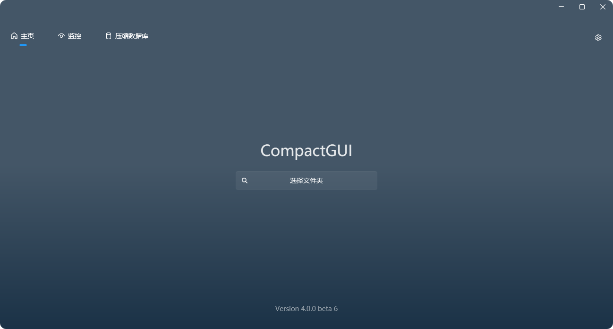

&nbsp;

<b>CompactGUI 可以透明地压缩您的游戏和程序，减少它们占用的空间，同时不影响其功能。 它直接与 Win32 API 交互，实现与 Windows 10 及更高版本中提供的原生命令行工具 <code>compact.exe</code> 相同的功能。</b>

&nbsp;
&nbsp;

</>

---

  <a href="README.md">English</a> -
  <a href="README_cn.md">简体中文</a>

&nbsp;

**什么是 `compact.exe`?**
它是一个命令行工具，包含 Windows 10 中引入的新算法集合，可以让你几乎不损失性能的情况下透明地压缩游戏、程序和其他文件夹。

**透明？这是什么意思？**
透明压缩意味着文件仍然可以像以前一样在计算机上正常使用——它们不会像 Zip 和 Rar 文件那样被重新打包。您可以像以前一样浏览网页、启动游戏和程序。

**这和旧版 Windows 内置压缩有什么不同？**
这与 Windows 内置的 NTFS-LZNT1 压缩类似（右键点击 > 属性 > 压缩以节省空间），但是 Windows 10 及更高版本引入的新算法要优越得多，能够实现更高的压缩率，且几乎不会影响性能。对于拥有旧硬盘的用户来说，甚至可能看到性能提升，表现为加载时间减少——较小的文件可以更快地读入内存，而 CPU 能够比原本硬盘更快地即时解压缩它们。[更多信息请点击此处](https://msdn.microsoft.com/en-us/library/windows/desktop/hh920921(v=vs.85).aspx)

<h2>安装  </h>    

####

- 
从 <a href="https://github.com/IridiumIO/CompactGUI/releases"><b>GitHub 发行版</b></a> 下载

- 使用 Winget 安装： `winget install CompactGUI`

## 使用

使用此工具来压缩文件夹，同时还能正常使用/运行它们：

- 减小游戏的体积（例如：ARK-Survival Evolved: 169 GB > 91.2 GB）
- 减小程序的体积（例如：Adobe Photoshop: 1.71 GB > 886 MB）
- 压缩电脑上的任何文件夹
  
## 附加功能

- 压缩进度和统计信息的视觉反馈
- 可配置的不适合压缩文件类型列表，可以选择跳过。
- 在线获取社区来源的 [数据库](https://github.com/ImminentFate/CompactGUI/wiki/Community-Compression-Results) 以获取压缩预估结果
- Steam 游戏的压缩结果可以从 CompactGUI 内提交到在线数据库
- 集成到 Windows 资源管理器的上下文菜单中，以便更方便地使用。
- 分析现有文件夹的状态
- 后台监视器 - 跟踪文件夹并监视其变化（例如 Steam 游戏更新），并在后台自动对其进行压缩。

<h4 align="center"> 已统计的游戏列表见 <a href="https://github.com/ImminentFate/CompactGUI/wiki/Community-Compression-Results">Wiki</a>   现在已提交的测试记录 </b></h3>

&nbsp;

## 注意

**此工具不适合用于使用 Windows 11 DirectStorage 的游戏。**

DirectStorage 是一种新的 API，它允许游戏直接从 SSD 加载资源，绕过 CPU。压缩文件需要先解压缩才能发送到 GPU，这会抵消任何性能提升。

## 背景

Windows 10 引入了一个鲜为人知但非常有用的工具，称为“compact.exe”，允许在运行时压缩磁盘上的文件夹和文件，进行解压。对于任何现代 CPU（我测试过 2010 年的 i3-370M，影响几乎不大），这种额外负载几乎不会被察觉，节省空间的优势在配备较小 SSD 的设备中最为实用。

由于程序文件夹和游戏可以大幅压缩，这还有一个额外好处，就是可能缩短加载时间——尤其是在慢速的机械硬盘上。

关于内置 Windows 功能的更多信息，请查看 [这里](https://technet.microsoft.com/en-au/library/bb490884.aspx) 和 [这里](https://msdn.microsoft.com/en-us/library/windows/desktop/hh920921(v=vs.85).aspx) 或在命令行中输入 `compact /q`

该工具设计时专门只压缩文件夹和文件。整个硬盘和整个 Windows 安装无法在 CompactGUI 内部修改——寻求此功能的用户应使用命令行中的`compact /compactOS`。

压缩完全透明——程序、游戏和文件仍可正常访问，并在资源管理器中显示，只是运行时解压到内存中，保持压缩在磁盘上。

## 压缩模式

默认情况下，程序运行 Compact 并启用“XPRESS8K”算法。这在压缩速度和体积减小之间取得了良好的平衡。Windows 默认是“XPRESS4K”，速度更快但压缩更少。

可选压缩模式：

算法|核心优势|详细介绍
:---|:---|:---
XPRESS4K|读取速度极快，压缩率合理|适合对读取速度要求极高的游戏文件，能够在压缩的同时最大化性能表现
XPRESS8K|压缩速度和压缩率双平衡|在压缩速度和压缩率之间取得了更好的平衡
XPRESS16K|高压缩率，处理速度较慢|适合用于存储空间紧张且对加载速度要求不高的场景
LZX|压缩率最高，解压速度最慢|适合用于存档文件、备份数据或不经常访问的冷数据存储

---

### 喜欢这个项目吗？

 请考虑在 Ko-Fi 上打赏一下 :)

 

  