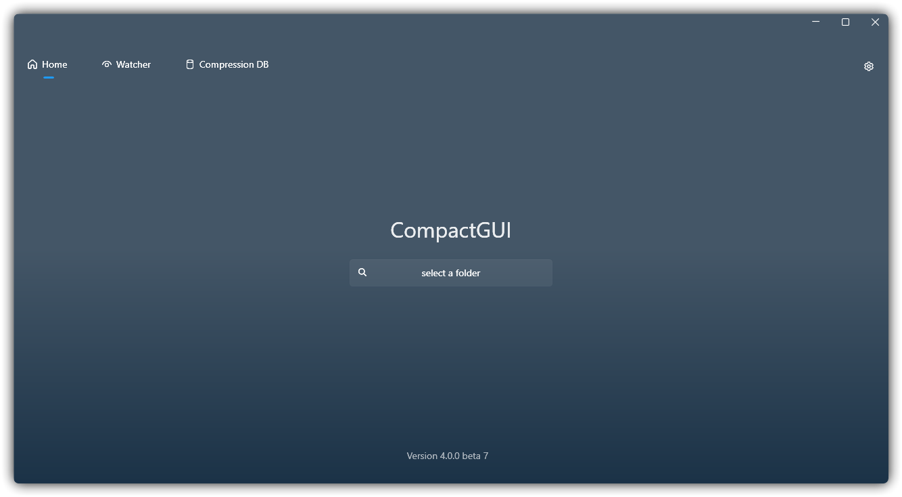
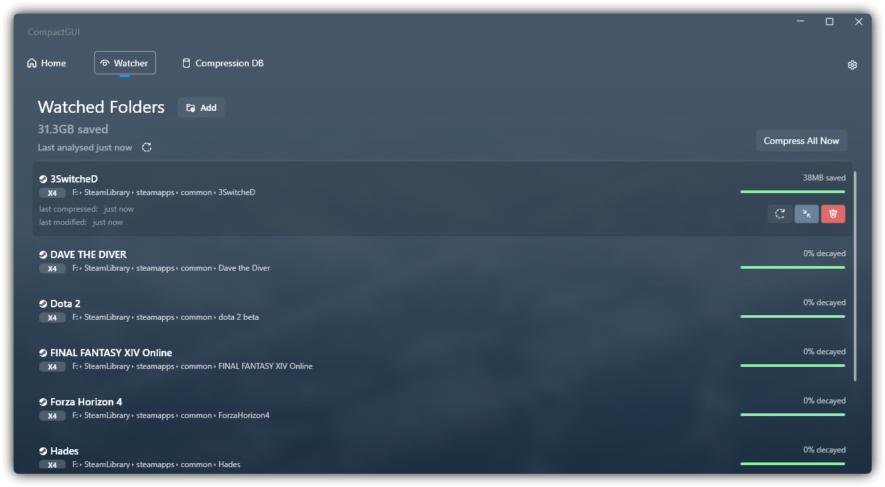

&nbsp;

<b>CompactGUI прозрачно сжимает ваши игры и программы, уменьшая занимаемое ими место без потери функциональности. Он работает напрямую с Win32 API и делает то же самое, что и родная утилита командной строки <code>compact.exe</code>, доступная в Windows 10 и новее.</b>

&nbsp;
&nbsp;

</>

---

  <a href="README.md">English</a> -
  <a href="README_ru.md">Русский</a> -
  <a href="README_cn.md">简体中文</a>

&nbsp;

**Что такое `compact.exe`?**
Это командный инструмент с набором новых алгоритмов, представленных в Windows 10, который позволяет прозрачно сжимать игры, программы и другие папки практически без потери производительности.

**Прозрачно? Что это значит?**
Прозрачное сжатие означает, что файлы по‑прежнему можно использовать на компьютере как ни в чём не бывало — они не переупаковываются, как файлы Zip или Rar. Вы можете просматривать, запускать игры и программы точно так же, как и раньше.

**Чем это отличается от встроенного сжатия в старых версиях Windows?**
Это похоже на встроенное в Windows сжатие NTFS-LZNT1 (ПКМ > Свойства > Сжимать для экономии места), однако новые алгоритмы, появившиеся в Windows 10+, значительно превосходят его, обеспечивая бóльшую степень сжатия и почти не влияя на производительность. На старых HDD можно даже получить выигрыш в скорости загрузки — файлы меньшего размера быстрее читаются в ОЗУ, а процессор может распаковывать их на лету гораздо быстрее, чем обычный HDD способен их подавать. [Подробнее можно узнать здесь](https://msdn.microsoft.com/en-us/library/windows/desktop/hh920921(v=vs.85).aspx)

<h2>Установка</h2>    

####

- 
Скачайте со страницы <a href="https://github.com/IridiumIO/CompactGUI/releases"><b>GitHub Releases</b></a>

- Установите через Winget: `winget install CompactGUI`

## Назначение

Используйте этот инструмент для сжатия папок с сохранением возможности обычного использования/запуска:

- Уменьшение размера игр (например, ARK: Survival Evolved: 169 ГБ > 91,2 ГБ)
- Уменьшение размера программ (например, Adobe Photoshop: 1,71 ГБ > 886 МБ)
- Сжатие любых других папок на вашем компьютере

## Дополнительные возможности

- Визуальная индикация хода сжатия и статистика
- Настраиваемый список плохо сжимаемых типов файлов, которые можно пропускать
- Интеграция с общедоступной [базой данных](https://github.com/ImminentFate/CompactGUI/wiki/Community-Compression-Results) для оценки степени сжатия (данные от сообщества)
  - Результаты сжатия игр Steam можно отправлять в эту базу прямо из CompactGUI
- Интеграция в контекстное меню проводника для удобства использования
- Анализ состояния существующих папок
- Фоновый наблюдатель — отслеживает изменения в папках (например, обновления игр Steam) и автоматически поддерживает их в сжатом состоянии в фоне.

<h4 align="center"><b>Смотрите <a href="https://github.com/ImminentFate/CompactGUI/wiki/Community-Compression-Results">Вики</a> со списком , протестированных на основе  отчётов</b></h3>

&nbsp;

## Важное замечание

**Этот инструмент не следует использовать для игр, которые применяют DirectStorage в Windows 11.**

DirectStorage — это новый API, позволяющий играм загружать ресурсы напрямую с SSD, минуя процессор. Сжатые файлы потребуют распаковки перед отправкой в видеокарту, что сведёт на нет прирост в производительности.

## Предыстория

В Windows 10 появился малоизвестный, но очень полезный инструмент `compact.exe`, который позволяет сжимать папки и файлы на диске, распаковывая их во время выполнения. На любом современном процессоре (я тестировал даже на i3-370M 2010 года с пренебрежимо малым влиянием) эта дополнительная нагрузка почти незаметна, а экономия места особенно полезна для владельцев небольших SSD.

Поскольку размер папок с программами и игр может быть сокращён до 60%, это даёт дополнительный бонус в виде потенциального сокращения времени загрузки — особенно на медленных HDD.

Больше информации о встроенной функции Windows можно найти [здесь (англ.)](https://technet.microsoft.com/library/bb490884.aspx) и [здесь](https://msdn.microsoft.com/library/windows/desktop/hh920921(v=vs.85).aspx) или введя `compact /q` в командной строке.

Этот инструмент намеренно предназначен только для сжатия папок и файлов. Целые диски и полные установки Windows не могут быть изменены через CompactGUI — пользователям, которым нужна такая функциональность, следует использовать `compact /compactOS` из командной строки.

Сжатие полностью прозрачно: программы, игры и файлы по‑прежнему доступны как обычно и отображаются в проводнике в обычном виде — они просто распаковываются в ОЗУ во время выполнения, оставаясь сжатыми на диске.

## Режимы сжатия

По умолчанию программа запускает Compact с активным алгоритмом `XPRESS8K`. Он обеспечивает хороший баланс между скоростью сжатия и степенью уменьшения размера. По умолчанию Windows использует `XPRESS4K` — он быстрее, но сжимает хуже.

Доступные режимы сжатия:

| Алгоритм     | Основные преимущества                                                                 | Подробное описание                                                                               |
|--------------|---------------------------------------------------------------------------------------|--------------------------------------------------------------------------------------------------|
| XPRESS4K     | Самый быстрый, но наименьшее сжатие                                                   | Подходит для игровых файлов с очень высокими требованиями к скорости чтения, максимизирует производительность при сжатии. |
| XPRESS8K     | Баланс скорости и сжатия                                                              | Достигает оптимального соотношения между скоростью сжатия и степенью уменьшения размера. |
| XPRESS16K    | Медленнее, но сильнее                                                                 | Подходит для сценариев с ограниченным дисковым пространством и невысокими требованиями к скорости загрузки. |
| LZX          | Самый медленный, но самый сильный                                                     | Подходит для хранения архивных данных, резервных копий или редко используемых «холодных» данных. |

---

### Нравится этот проект?

Пожалуйста, подумайте о том, чтобы поддержать автора на Ko-Fi :)

